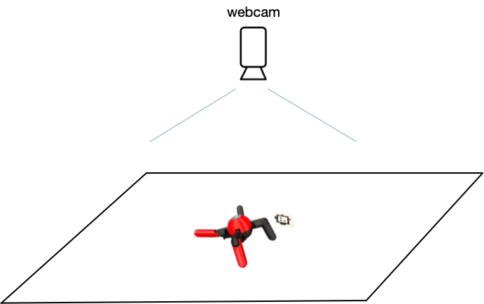

# Embodied Ant



## Hardware

The hardware is designed to be easy to build and use:
- single computer operation via USB, python only, minimal dependencies (no embedded firmware / OS, networking, ROS...)
- no battery: continuous operation with wall adapter
- all COTS parts + 3D printed parts
- no soldering required
- no special tools required (only a screwdriver for M2 and M2.5)

### Bill of Materials

| Part Name                | Quantity | Notes                        | Link                                      |
|--------------------------|----------|------------------------------|-------------------------------------------|
| Dynamixel XL430-W250-T   | 8        | Main actuators  (incl.  180mm cable)              | [Robotis](https://www.robotis.us/dynamixel-xl430-w250-t/) |
| HN11-I101 Set            | 8        | Idler bearing                | [Robotis](https://www.robotis.us/hn11-i101-set/) |
| U2D2 Starter Set         | 1        | Includes: USB to Dynamixel, Power Hub Board, 12V 5A Power Suppy    | [Robotis](https://www.robotis.us/dynamixel-starter-set-us/) |
| Kakute H7 Mini / TBS Lucid Freestyle mini | 1 | Quadcopter flight controller used as IMU (Any Betaflight compatible autopilot with 20x20mm mouts will work) | [getfpv](https://www.getfpv.com/tbs-lucid-freestyle-f4-mini-flight-controller-icm42688-20x20.html)
| Cable Matters Ultra Mini USB Hub | 1 | 4 Port USB Hub               | [Amazon](https://www.amazon.com/dp/B00PHPWLPA/) |
| short USB-A to USB-C Cable | 1      | For autopilot (IMU)          | [Amazon](https://www.amazon.com/dp/B01ASXBY62) |
| short USB-A to miro-USB cable | 1   | For Dynamixel U2D2           | [Amazon](https://www.amazon.com/dp/B08BZD66H4?th=1)
| USB-A extension cable    | 1       | As tether for the robot       | [Amazon](https://www.amazon.com/dp/B07ZV6FHWF/)
| Screw M2x5mm             | 64      | Output shaft, 8 per motor     | [McMaster](https://www.mcmaster.com/91290A012/)
| Screw M2x12mm            | 24      | 3D print assembly 5 per leg + IMU | [McMaster](https://www.mcmaster.com/91290A019/)
| Screw M2.5x16mm          | 32      | motor mount, 4 per motor      | [McMaster](https://www.mcmaster.com/91290a106/)
| Nut M2                   | 20      | 3D print assembly 5 per leg   | [McMaster](https://www.mcmaster.com/91828A111/)
| Screw M3x8mm             | 2       | U2D2 power board mount        | [McMaster](https://www.mcmaster.com/91290A113/)
| Nut M3                   | 2       | U2D2 power board mount        | [McMaster](https://www.mcmaster.com/91828A211/)
| 3D Printed Parts         | -       | STL files in `hardware/`      | -                                         |


### Dynamixel Setup

The following command will change the baudrate of all motors on the port to 1Mbaud.
```
python3 dynamixel_change_baud.py /dev/tty.usbserial-FT7WBGG8 1000000
```

## Software Setup

Create a virtual environment and install the dependencies. (python >= 3.10)
```
python3.12 -m venv ant_env
source ant_env/bin/activate
pip install -r requirements.txt
```

### Misc

if git push fails when adding large (~10MB) commits, try:
```
git config --global http.postBuffer 1048576000
```

### Possible signals

- Joint position
- Joint velocity
- Body angular rate
- Inertial up in body
- Commanded velocity in x and y

For reward: position of the body in x and y, and the angle of the body.


## Run the simulation

```
cd sim
python3 ant_mujoco.py
```